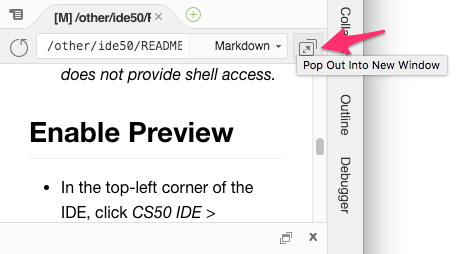

# ide50

Go to [ide.cs50.io](https://ide.cs50.io/) and login with your Github account

## Setting up an SSH key between cs50 IDE and Github

#### Configure your user info
* `git config --global user.email "you@example.com"`
* `git config --global user.name "Your Name"`

#### Generate and connect an SSH key
* `cd ~` makes sure you are in the root directory
* `ls -al ~/.ssh` you should see no files that start with `id_rsa`
* `ssh-keygen -t rsa -b 4096 -C "you@example.com"` generates a new SSH key (press <kbd>ENTER</kbd> to save default file path; press <kbd>ENTER</kbd> again (twice) to leave the passphrase blank)
* `eval "$(ssh-agent -s)"` starts the agent in the background
* `ls -al ~/.ssh` you should now see a file named `id_rsa.pub`
* `cat ~/.ssh/id_rsa.pub` then copy _all_ of the result to your clipboard
* Go to https://github.com/settings/keys > New SSH Key
  * Title: ide50
  * Key: paste your ssh key
* Back in your cs50 IDE, do `sudo nano ~/.ssh/config`
* Paste the following:
```
Host github.com
 Hostname ssh.github.com
 Port 443
```
* <kbd>CTRL</kbd>+<kbd>X</kbd> to exit, then press <kbd>Y</kbd> then <kbd>ENTER</kbd>
* `ssh -T git@github.com`
* Type `yes`, press <kbd>ENTER</kbd>, and you should see
> Hi "username"! You've successfully authenticated, but GitHub does not provide shell access.

## Enable Preview
* In the top-left corner of the IDE, click **CS50 IDE** > Preferences
* When the new window opens, on the LEFT side, click **User Settings**
* On the RIGHT side, toggle **Enable Preview** to **ON**
* Now you are able to right-click on a file (i.e. HTML or Markdown) and click **Preview**
  * On a Mac, if you have a mouse with no right-click, hold <kbd>CONTROL</kbd> then click
* Tip 1: Drag the new tab that appeared to the right side of your IDE _(similar to the image below)_

* Tip 2: Use the pop-out icon to preview outside the IDE _(similar to the image below)_


## Enable Auto-Save
* If you closed the Preferences tab, re-open it: **CS50 IDE** > Preferences
* When the new window opens, on the LEFT side, click **Experimental**
* On the RIGHT side, change the **Auto-Save** dropdown to **On Focus Change**
  * When editing a file, you should see a red dot in the tab, next to the filename
  * A red dot means there are unsaved changes
  * When you change (i.e. "focus") to a different window (i.e. "preview"), the red dot will turn green, then back to an **X**
* You can also force a save by going to **File** > **Save** or using the keyboard shortcut (i.e. <kbd>⌘</kbd>+<kbd>S</kbd>)

#### Sources:
* https://help.github.com/en/articles/adding-a-new-ssh-key-to-your-github-account
* https://stackoverflow.com/questions/15589682/ssh-connect-to-host-github-com-port-22-connection-timed-out